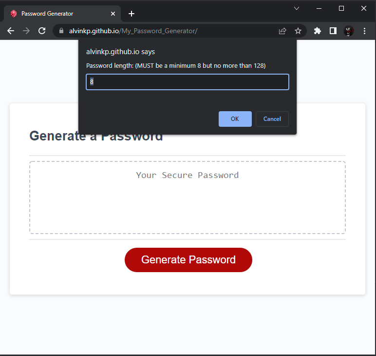
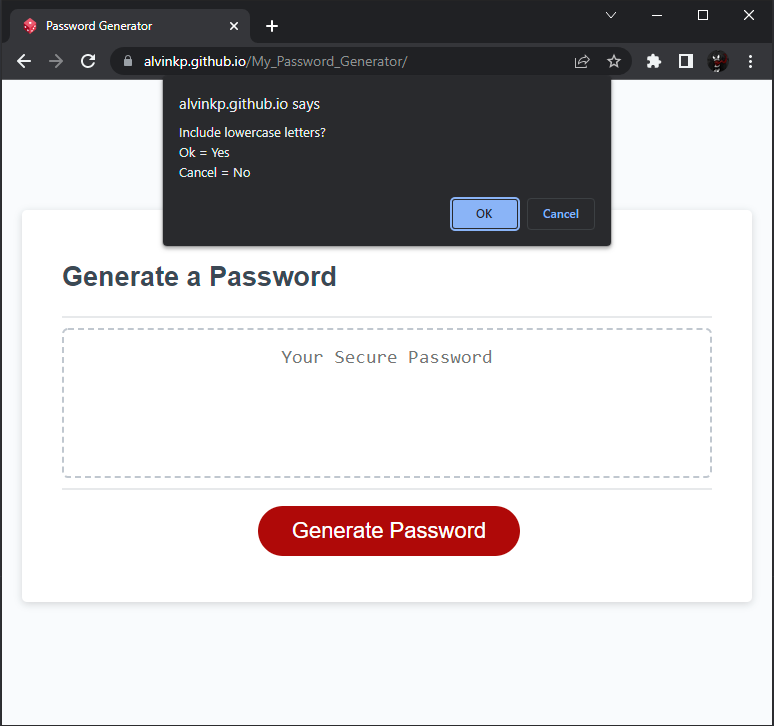
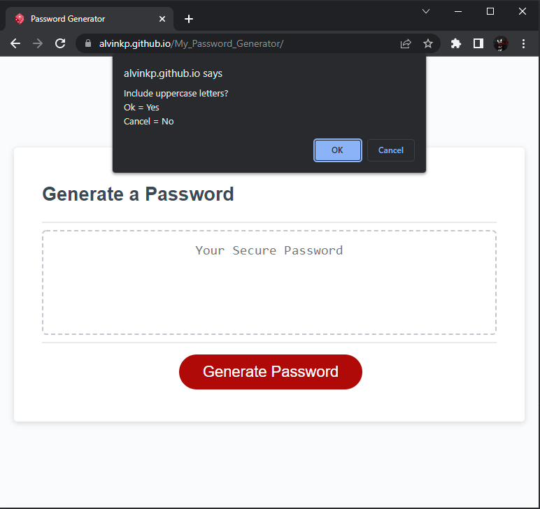
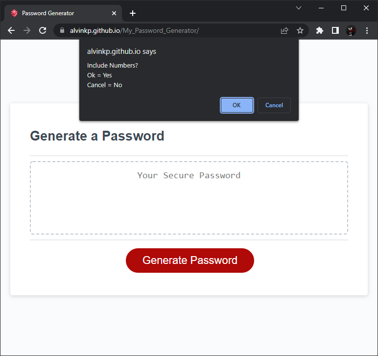
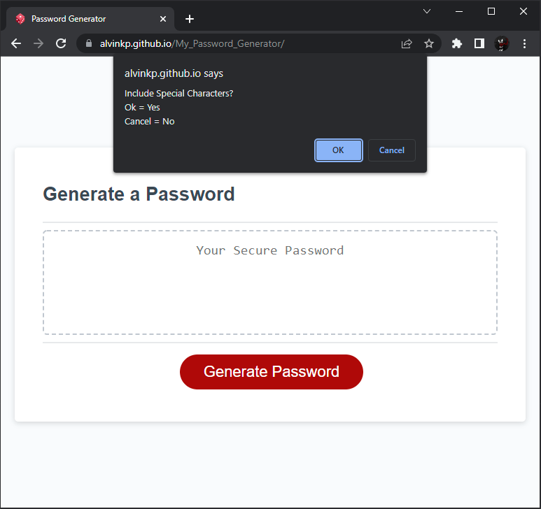
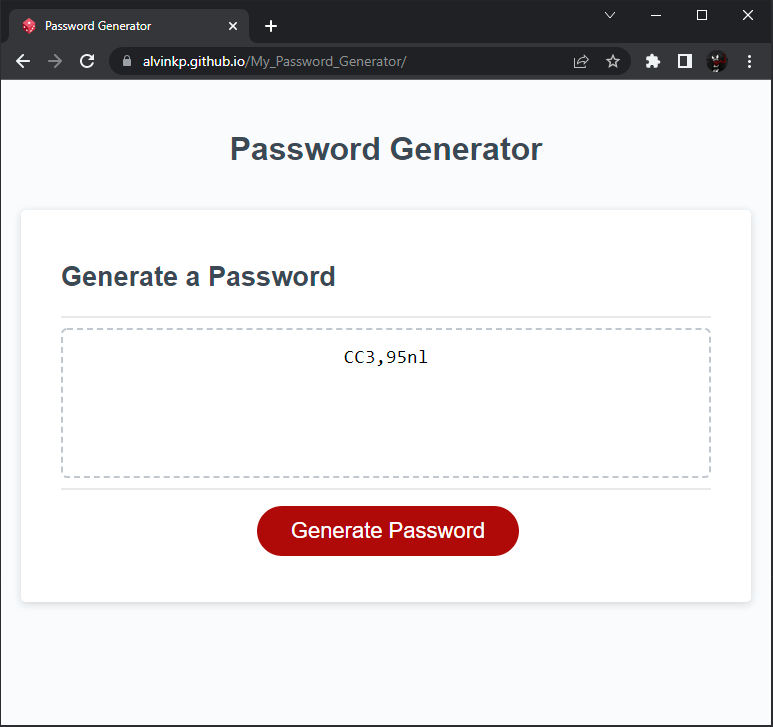

# My Password Generator

This was the third challenge assignment for our UPENN Bootcamp. We were tasked with creating a Password Generator. (See **User Story** and **Acceptable Criteria** sections below).

---

## 📕 User Story 

AS AN employee with access to sensitive data
I WANT to randomly generate a password that meets certain criteria
SO THAT I can create a strong password that provides greater security

---

## ✔️ Acceptable Criteria 

- GIVEN I need a new, secure password
- WHEN I click the button to generate a password THEN I am presented with a series of prompts for password criteria
- WHEN prompted for password criteria THEN I select which criteria to include in the password
- WHEN prompted for the length of the password THEN I choose a length of at least 8 characters and no more than 128 characters
- WHEN asked for character types to include in the password THEN I confirm whether or not to include lowercase, uppercase, numeric, and/or special characters
- WHEN I answer each prompt THEN my input should be validated and at least one character type should be selected
- WHEN all prompts are answered THEN a password is generated that matches the selected criteria
- WHEN the password is generated THEN the password is either displayed in an alert or written to the page

---

## 🔧 Optimizations 

### HTML
- Created prompts to ask user for input and preferences.
- Checked user input to make sure they were giving us a number that was valid.
- Checked that user chose at least one criteria for password.
- Created individual character generators.
- Ensured password had at LEAST one of each selected criteria.

---

## 📷 Screenshots 

---

## 🎯 Deployment

Website: https://alvinkp.github.io/My_Password_Generator/

Repository: https://github.com/alvinkp/My_Password_Generator

---

## ✉️ Authors 

- [@alvinkp](https://www.github.com/alvinkp)

